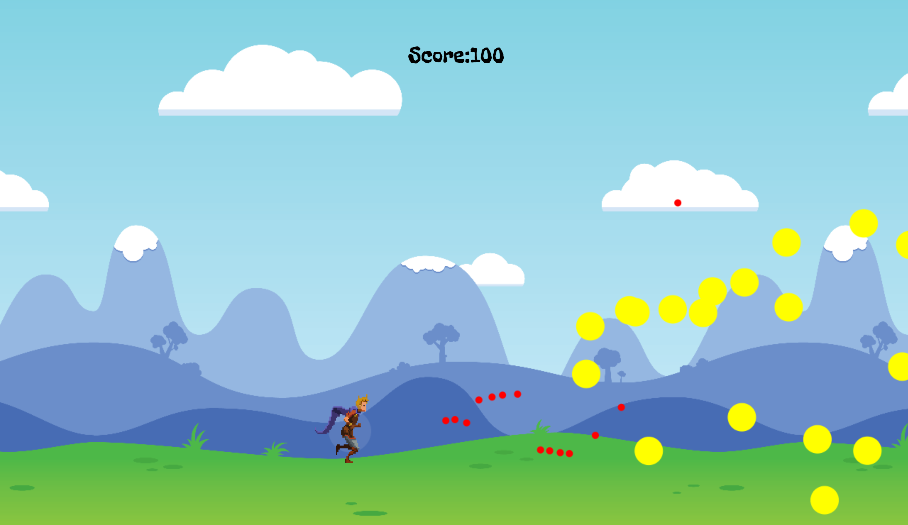

# shooting-fire-ball

## Game Link
https://daniel84ting.github.io/shooting-fire-ball/

## Technologies
1. HTML 5
1. CSS
1. JavaScript
1. Jquery
1. Ajax
1. Canvas

## API used
https://official-joke-api.appspot.com/jokes/random

## Game Instructions 
- Running Man shoot the fireball to gain the score, when the bullet hit the fireball will get 100 point. shooting the fireball in diferent angle by using mouse clicking. If the fireball hit the running man will Game Over and will show how much score you get.

## screenshots picture

1. Press start button to start the Game.

1. The Running man shooting the fireball. 

1. When Game Over will show the total score point and the random Jokes.

## Additional Features were under Considerations
- Set the timer.
- store the player name and score.